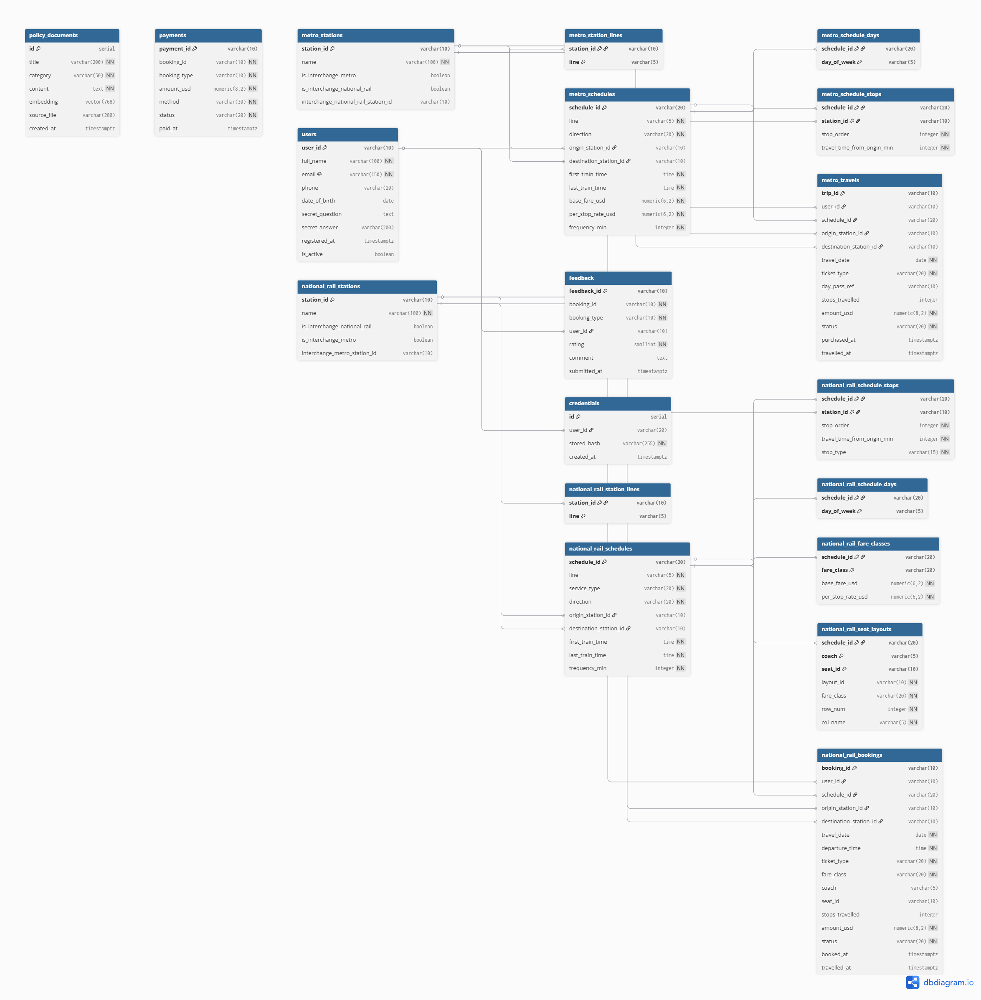
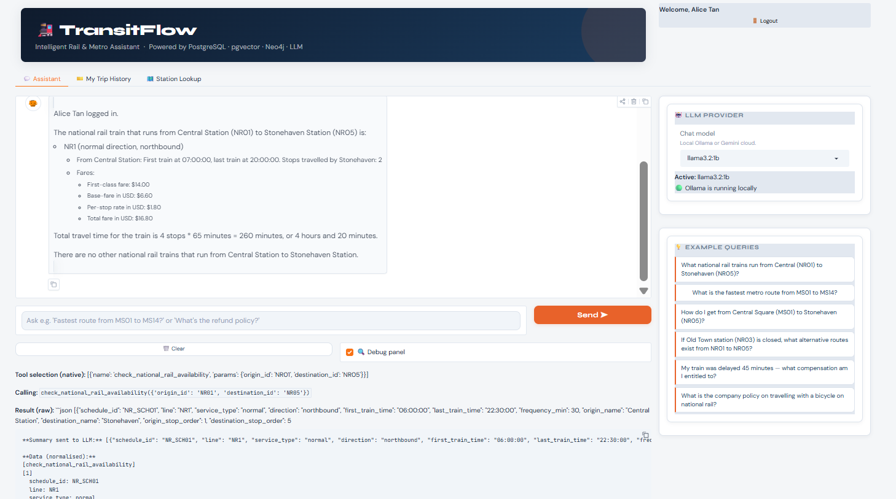
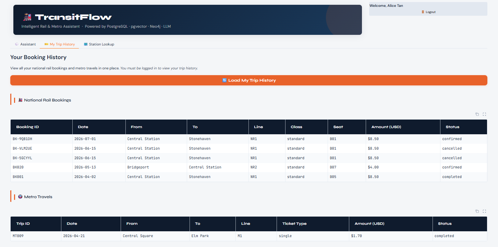
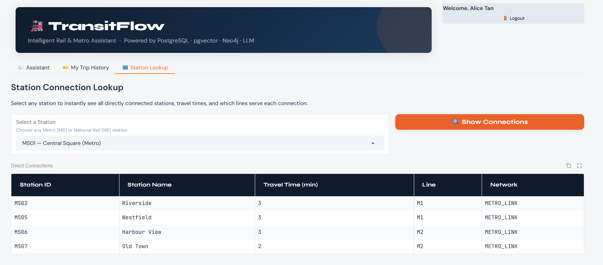

# TransitFlow — Database Design Document

<!-- ============================================================
  編輯說明（給組員看，繳交前請刪除此區塊）
  ============================================================
  繳交檔名格式：Team<Id>_DESIGN_DOC.md（例如 Team01_DESIGN_DOC.md）
  繳交方式：Markdown 或 PDF，透過 EEClass 上傳

  文件共六個章節（標題必須與下方完全一致，否則可能不被計分）。
  標記 [TODO] 的地方代表需要組員補充，其餘已根據現有程式碼填寫完成。

  各章節滿分：
    Section 1 — ER Diagram              : /25
    Section 2 — Normalisation           : /20
    Section 3 — Graph Design Rationale  : /25
    Section 4 — Vector / RAG Design     : /15
    Section 5 — AI Tool Usage Evidence  : /10
    Section 6 — Reflection & Trade-offs : /5
  ============================================================ -->

---

## Section 1 — Entity-Relationship Diagram

<!-- ============================================================
  評分重點（共 25 分）：
  1. 所有 entity 都出現在圖中
  2. Cardinality（1:N、M:N 等）必須標在「圖的連線上」，不能只寫在說明文字
  3. 每個 entity 要顯示 PK、主要 FK、以及 2–3 個代表性欄位
  4. 必須用工具繪製（dbdiagram.io / draw.io / Lucidchart），不接受手繪

  [TODO] 請用 dbdiagram.io 或 draw.io 畫出以下的 ER 圖並嵌入截圖。
         圖中每條連線都要有 cardinality 符號（1、N、M 等）。
         建議參考下方的 Entity 清單來確認所有 entity 都有涵蓋。

  注意陷阱：cardinality 標記若只出現在說明段落而不在圖上，該項得 0 分。
  ============================================================ -->

### [TODO] ER 圖（請嵌入圖片）

> 請在此處插入 dbdiagram.io / draw.io 產出的 ER 圖截圖。


### Entity 清單與主要關聯

以下列出所有 entity 及其關聯，供繪圖參考：

**schema1（主要業務資料）**

| Entity | PK | 主要關聯 |
|--------|----|----------|
| `users` | `user_id` (VARCHAR) | 1 user → N `national_rail_bookings`；1 user → N `metro_travels`；1 user → N `feedback` |
| `metro_stations` | `station_id` | 1 station → N `metro_station_lines`；1 station → N `metro_schedule_stops` |
| `metro_station_lines` | (station_id, line) | M:N junction：metro_stations ↔ lines |
| `metro_schedules` | `schedule_id` | 1 schedule → N `metro_schedule_stops`；1 schedule → N `metro_schedule_days` |
| `metro_schedule_stops` | (schedule_id, station_id) | stop 序列 junction table |
| `metro_schedule_days` | (schedule_id, day_of_week) | 運行日期 junction table |
| `national_rail_stations` | `station_id` | 類同 metro_stations |
| `national_rail_station_lines` | (station_id, line) | M:N junction |
| `national_rail_schedules` | `schedule_id` | 1 → N stops、days、fare_classes |
| `national_rail_schedule_stops` | (schedule_id, station_id) | |
| `national_rail_schedule_days` | (schedule_id, day_of_week) | |
| `national_rail_fare_classes` | (schedule_id, fare_class) | |
| `national_rail_seat_layouts` | (schedule_id, coach, seat_id) | 1 schedule → N seats |
| `national_rail_bookings` | `booking_id` | N bookings → 1 user；N bookings → 1 schedule；soft ref → `payments` |
| `metro_travels` | `trip_id` | N trips → 1 user；soft ref → `payments` |
| `payments` | `payment_id` | soft ref → booking（rail 或 metro） |
| `feedback` | `feedback_id` | soft ref → booking；N → 1 user |
| `policy_documents` | `id` (SERIAL) | pgvector 使用，獨立存放 |

**schema2（認證資料，獨立隔離）**

| Entity | PK | 說明 |
|--------|----|------|
| `credentials` | `id` (SERIAL) | 存放 Argon2id 密碼雜湊；透過 `user_id` FK 連結 schema1.users |

---

## Section 2 — Normalisation Justification

<!-- ============================================================
  評分重點（共 20 分）：
  1. 至少一個 2NF 或 3NF 設計決策，需「點名 normal form + 說明 functional dependency」
  2. 討論至少一個刻意的 de-normalisation（或解釋為何不需要）
  3. Argon2id：說明為何優於 MD5/SHA-1，以及 salt 如何防彩虹表
  4. 正確使用資料庫術語（functional dependency、candidate key、transitive dependency 等）
  ============================================================ -->

### 2.1 第三正規化（3NF）設計決策：Stop 序列獨立為 Junction Table

在設計 `metro_schedules` 和 `national_rail_schedules` 時，Stop 序列（即每班列車經過哪些站、以何種順序）**沒有**以陣列欄位（如 `TEXT[]` 或 JSON column）儲存在 schedule 主表中，而是獨立抽出為：

- `metro_schedule_stops(schedule_id, station_id, stop_order, travel_time_from_origin_min)`
- `national_rail_schedule_stops(schedule_id, station_id, stop_order, travel_time_from_origin_min, stop_type)`

**Functional dependency 分析：**

若將 stop 資料直接嵌入 schedule 表，形成如 `(schedule_id, stop_order, station_id, travel_time)` 的 repeating group，則違反第一正規化（1NF）。進一步地，`travel_time_from_origin_min` 的值由 `(schedule_id, station_id)` 共同決定，而非僅由 `schedule_id` 決定——若放在 schedule 主表中，則因 partial dependency 而違反 2NF。

將 stops 獨立為 junction table 後：

- `schedule_id` → schedule 層級的屬性（line、direction、fare 等）
- `(schedule_id, station_id)` → stop 層級的屬性（stop_order、travel_time）

不存在 transitive dependency，達到 3NF。

**實際效益：** 查詢兩站之間的停靠順序（用於訂票和路線查詢）只需一次 JOIN，SQL 易讀且可加索引優化。若改用陣列欄位，則需在應用層解析，效率更低且難以查詢。

---

### 2.2 刻意的 De-normalisation：`amount_usd` 存入 `national_rail_bookings`

`national_rail_bookings` 表中包含 `amount_usd` 欄位，記錄訂票當下的票價金額。理論上此值可由 `national_rail_fare_classes` 計算得出（`base_fare + per_stop_rate × stops_travelled`）。

這是一個刻意的 de-normalisation 決策，原因如下：

1. **歷史保存**：票價規則可能隨時間調整，若不存入訂票記錄，日後查詢歷史訂單會計算出錯誤金額。
2. **退款計算**：`execute_cancellation()` 需要快速讀取原始金額來計算退款比例，不需再 JOIN fare_classes 表。
3. **Write-once 特性**：`amount_usd` 在訂票時確定後不再變動，不存在更新異常（update anomaly）的風險。

---

### 2.3 密碼雜湊：Argon2id 的選擇理由與 Salt 機制

#### 為何選擇 Argon2id 而非 MD5 / SHA-1 / SHA-256？

MD5 和 SHA-1 是通用雜湊函數（general-purpose hash functions），設計目標是**速度快**。這對密碼儲存而言是致命缺陷：現代 GPU 每秒可計算數十億次 MD5，攻擊者能在極短時間內暴力破解大量密碼。

Argon2id 是專為密碼雜湊設計的**Key Derivation Function（KDF）**，具備：

- **Memory-hard**：雜湊過程需佔用大量記憶體（預設數十 MB），使 GPU 並行攻擊成本大幅提升。即使攻擊者擁有高性能 GPU，每秒能計算的雜湊次數遠少於 MD5。
- **Cost factor 可調整**：隨著硬體進步，可調高記憶體或時間參數，讓雜湊計算維持足夠慢的速度，而不需更換演算法。
- **Argon2id 變體**：結合 Argon2i（防 side-channel 攻擊）與 Argon2d（防 GPU 攻擊）的優點。

Bcrypt、scrypt、PBKDF2 也是合格的 KDF，但 Argon2id 是 2015 年 Password Hashing Competition 的勝者，是目前最新的推薦標準。

#### Salt 如何防止彩虹表攻擊？

Salt 是在雜湊密碼前自動附加的一段**隨機字串**，由 Argon2id 函式庫自動生成並嵌入雜湊結果中。

考慮兩個使用者都設定密碼 `"password123"`：

- **無 salt**：兩人得到相同雜湊值 `abc123...`。攻擊者只需預先計算常見密碼的雜湊表（彩虹表），即可一次查出所有使用相同密碼的帳號。
- **有 salt**：使用者 A 的 salt 為 `x7f3...`，雜湊 `"password123" + "x7f3..."` 得到 `hash_A`；使用者 B 的 salt 為 `q2m9...`，得到完全不同的 `hash_B`。彩虹表對每個不同 salt 都必須重新計算，實際上使彩虹表攻擊無效。

在本系統中，`argon2-cffi` 套件的 `PasswordHasher().hash(password)` 呼叫自動生成唯一 salt 並將其嵌入雜湊字串中，`verify()` 則自動從雜湊字串中提取 salt 進行驗證，整個過程對應用層透明。

---

### 2.4 Primary Key 設計決策：VARCHAR vs UUID vs SERIAL

本系統採用 **VARCHAR(10) 作為大多數表的 PK**（如 `RU01`、`NR_SCH01`、`BK-A1B2C3`），而非自動遞增的 SERIAL 或隨機的 UUID。

<!-- [TODO] 請補充你們的選擇理由，以下是參考論點，請依實際討論修改 -->

**選擇理由：**
- 本系統為**單一部署的教育環境**，不存在分散式系統需要全局唯一 ID（UUID 的主要應用場景）。
- VARCHAR PK 在 debug 和人工查詢時具可讀性（`BK-A1B2C3` 明顯是訂單 ID），降低操作錯誤風險。
- 相較 UUID 的 36 字元，VARCHAR(10) 佔用空間更小，JOIN 效能略優。
- SERIAL 雖簡單，但無法攜帶業務語意（無法從 ID 判斷是 rail 還是 metro 訂單）。

---

## Section 3 — Graph Database Design Rationale

<!-- ============================================================
  評分重點（共 25 分）：
  1. 說明 nodes、relationships、properties 各自是什麼以及「為什麼這樣設計」
  2. 具體演算法論證（Dijkstra vs SQL recursive CTE），不能只說「graph 比較快」
  3. 描述至少兩種 query 類型，並解釋 graph model 如何使其成為可能
  4. 討論 node identity：哪個 property 唯一識別 node，以及為什麼
  ============================================================ -->

### 3.1 為什麼使用 Graph Database？

TransitFlow 需要回答的核心問題是：**「從 A 站到 B 站，最快路線是什麼？」**

若以 PostgreSQL 實作路線查詢，需要使用 **Recursive CTE（Common Table Expression）**，例如：

```sql
WITH RECURSIVE route AS (
    SELECT station_id, 0 AS total_time, ARRAY[station_id] AS path
    FROM stations WHERE station_id = 'MS01'
    UNION ALL
    SELECT l.to_station, r.total_time + l.travel_time, r.path || l.to_station
    FROM links l
    JOIN route r ON r.station_id = l.from_station
    WHERE NOT l.to_station = ANY(r.path)
)
SELECT * FROM route WHERE station_id = 'MS14'
ORDER BY total_time LIMIT 1;
```

此方式的問題：
- 每次查詢都需要掃描整個 `links` 表格
- 路徑去重（避免走回頭路）在 SQL 中複雜且效能差
- 無法直接使用 Dijkstra 等優化演算法，必須手動實作

Neo4j 原生支援 **APOC Dijkstra 演算法**，可直接以邊的 `travel_time_min` 屬性作為權重：

```cypher
CALL apoc.algo.dijkstra(origin, dest, 'METRO_LINK', 'travel_time_min', 0, 50)
YIELD path, weight
RETURN path, weight
```

這在圖資料庫中是 O((V + E) log V) 的高效操作，並且 Neo4j 內部以鄰接清單（adjacency list）儲存邊，遍歷相鄰節點的成本接近 O(1)，而 SQL JOIN 每次都需要掃描 B-tree 索引。

---

### 3.2 Graph 模型設計

#### Nodes（節點）

| Node Label | 儲存什麼 | 為何設計為 Node |
|------------|----------|----------------|
| `MetroStation` | 城市地鐵站（MS01–MS20） | 站是路線中的「實體」，具有身份（ID、名稱）和多條邊的連接點 |
| `NationalRailStation` | 國鐵站（NR01–NR10） | 與 MetroStation 不同的網絡，需要明確區分以支援 network-aware routing |

兩種 node label 分開設計的原因：地鐵和國鐵是獨立的票價和路線系統，查詢時需要限定在單一網絡中（使用 `METRO_LINK` 或 `RAIL_LINK`），混用會導致跨網絡的隨機路徑。

**Node Properties（節點屬性）：**
- `station_id`：唯一識別符（見 3.4 節）
- `name`：顯示名稱
- `lines`：所服務的路線（清單）
- `is_interchange_metro` / `is_interchange_national_rail`：標記換乘站

#### Relationships（關係）

| Relationship Type | 連結 | 屬性 | 為何設計為 Relationship |
|-------------------|------|------|------------------------|
| `METRO_LINK` | MetroStation → MetroStation | `travel_time_min`、`line` | 站與站之間的實體連接是典型的圖邊；權重（行車時間）直接掛在邊上，Dijkstra 可直接使用 |
| `RAIL_LINK` | NationalRailStation → NationalRailStation | `travel_time_min`、`line` | 同上 |
| `INTERCHANGE_TO` | MetroStation ↔ NationalRailStation | `travel_time_min`（固定 5 分鐘） | 跨網絡換乘是一種特殊的連接，需要與一般路線邊區分，避免混淆 routing 演算法 |

所有關係都是**有向（directed）**，因為 `METRO_LINK` 邊在 JSON 資料中雙向定義（每個站列出其相鄰站），確保 Dijkstra 可以從兩個方向查詢。

#### Properties（屬性）

屬性（而非節點）存放的資料：`travel_time_min` 是邊的屬性而非節點屬性，因為行車時間屬於「兩站之間的連接」而不屬於「站本身」。若存在節點上，則一個站連接多條線時會發生歧義。

---

### 3.3 支援的 Query 類型

#### Query Type 1：最快路線（Shortest Path by Time）

```cypher
CALL apoc.algo.dijkstra(origin, dest, 'METRO_LINK', 'travel_time_min', 0, 50)
YIELD path, weight
```

Graph model 使此查詢成為可能的原因：`travel_time_min` 直接存放在邊上，APOC 的 Dijkstra 實作可直接遍歷所有鄰接邊並累加權重，無需 JOIN 額外的表格。

#### Query Type 2：跨網絡換乘路徑（Interchange Path）

```cypher
CALL apoc.algo.dijkstra(origin, dest, 'METRO_LINK|RAIL_LINK|INTERCHANGE_TO', 'travel_time_min', 0, 50)
```

只需在 `rel_type` 參數中加入 `INTERCHANGE_TO`，演算法即可自動跨越地鐵和國鐵的網絡邊界。在 SQL 中實現這個查詢需要兩個獨立的 recursive CTE 加上 JOIN，複雜度遠高於此。

#### Query Type 3：Delay Ripple（影響範圍分析）

```cypher
MATCH (origin)-[*0..2]-(affected)
WHERE origin.station_id = $station_id
RETURN DISTINCT affected, length(path) AS hops_away
```

BFS（廣度優先搜尋）在圖資料庫中只需指定最大 hop 數，在關聯式資料庫中需要 N 層 recursive CTE。

---

### 3.4 Node Identity：`station_id` 的選擇

每個節點以 `station_id`（如 `MS01`、`NR05`）作為唯一識別符，使用 Neo4j `MERGE` 語法確保唯一性：

```cypher
MERGE (n:MetroStation {station_id: $id})
```

**選擇 `station_id` 而非 `name` 的原因：**
- `name` 可能重複（地鐵 "Old Town" 和國鐵 "Old Town Junction" 都含 "Old Town"），導致 MERGE 錯誤地合併節點
- `station_id` 是業務系統的主鍵，與 PostgreSQL 中的 FK 一致，確保跨資料庫的一致性
- 簡短的 ID 作為圖節點的 lookup key 效能優於長字串

---

## Section 4 — Vector / RAG Design

<!-- ============================================================
  評分重點（共 15 分）：
  1. 說明嵌入什麼、以及為何 cosine similarity 適合語意搜尋
     （不能只說「它測量相似度」，要說明為何是 magnitude-independent）
  2. 完整的 RAG 四步驟 pipeline
  3. Embedding 維度（768 或 3072）以及切換 provider 的後果
  ============================================================ -->

### 4.1 嵌入了什麼內容？

系統將以下政策文件嵌入向量資料庫（`schema1.policy_documents`）：

| 來源檔案 | 內容 |
|----------|------|
| `refund_policy.json` | 退票退款規則（RF001–RF005）：各種情況下的退款百分比 |
| `ticket_types.json` | 票種說明：單程票、日票、頭等艙、學生優惠等 |
| `booking_rules.json` | 訂票規則：提前購票限制、修改政策等 |
| `travel_policies.json` | 旅行政策：行李、自行車、寵物、飲食、行為規範等 |

這些文件透過 `skeleton/seed_vectors.py` 在啟動時嵌入，每筆記錄對應 `policy_documents` 表中的一行，包含 `title`、`category`、`content` 及 `embedding`（向量）。

---

### 4.2 為何使用 Cosine Similarity？

向量資料庫以 **Cosine Similarity（餘弦相似度）** 衡量查詢向量與文件向量的相似程度：

$$\text{similarity} = \frac{\vec{A} \cdot \vec{B}}{|\vec{A}||\vec{B}|}$$

**為何 Cosine Similarity 適合語意搜尋：**

Cosine Similarity 是**magnitude-independent（不受向量長度影響）**的相似度指標。它只衡量兩個向量在高維空間中的「方向」是否相同，而不考慮向量的絕對大小。

這對文字嵌入特別重要：一份關於「退款」的短句和一份包含更多「退款」相關用語的長段落，在嵌入空間中應該方向相近（語意相似），但因長度不同而向量大小可能差異很大。若使用 Euclidean Distance，長文件的向量會因為「較大」而被視為距離較遠，即使語意相近。Cosine Similarity 排除了這個干擾。

在 PostgreSQL 中，Cosine Distance（`<=>` 運算子）等於 `1 - cosine_similarity`，越小代表越相似：

```sql
SELECT title, 1 - (embedding <=> $query_vector) AS similarity
FROM schema1.policy_documents
ORDER BY embedding <=> $query_vector
LIMIT 5;
```

---

### 4.3 RAG Pipeline 完整流程

```
[使用者問題]
     │
     ▼  Step 1: Query Embedding
  skeleton/llm_provider.py
  llm.embed("My train was delayed 45 min, can I get compensation?")
  → 使用 nomic-embed-text（Ollama）將問題轉為 768 維向量 q
     │
     ▼  Step 2: Similarity Search
  databases/relational/queries.py :: query_policy_vector_search(q)
  → SQL: SELECT ... FROM policy_documents WHERE 1-(embedding<=>q) > 0.3
          ORDER BY embedding<=>q LIMIT 5
  → 找出語意最接近的政策文件（不依賴關鍵字匹配）
     │
     ▼  Step 3: Retrieved Documents → LLM Prompt
  skeleton/agent.py
  → 將查詢到的文件內容與原始問題組合成 prompt：
    "DATA FROM TRANSITFLOW DATABASE:
     [delay_compensation_policy]
     RF005: 30–59 min delay → 50% refund...
     User asks: My train was delayed 45 min..."
     │
     ▼  Step 4: LLM Generates Answer
  llm.chat(messages=..., system_prompt=...)
  → LLM 閱讀檢索到的政策，根據政策內容回答問題
  → 若沒有找到相關文件，agent 明確告知找不到（避免幻覺）
     │
     ▼
  [最終回答：依據 RF005，45 分鐘延誤可獲 50% 退款...]
```

**RAG 的關鍵優勢：** 使用者不需要知道政策文件的確切措辭。即使問「我的車晚點很久，有補償嗎？」（與文件中的「Delay Compensation」措辭完全不同），語意搜尋仍能找到正確的政策文件。

---

### 4.4 Embedding 維度與 Provider 切換

本系統目前使用 **Ollama 的 `nomic-embed-text` 模型**，產生 **768 維**向量：

```sql
-- schema.sql
embedding   vector(768)
```

若切換至 Gemini（`text-embedding-004` 模型），向量維度變為 **3072 維**。

**切換 provider 後的後果：**

已存入資料庫的向量是 768 維，新的查詢向量是 3072 維。PostgreSQL 的 `<=>` 運算子要求兩個向量**維度必須完全相同**，否則會拋出：

```
ERROR: different vector dimensions 768 and 3072
```

此時所有政策搜尋功能將完全失效。解決方式：

1. 更新 `schema.sql` 中的 `vector(768)` → `vector(3072)`
2. 重置資料庫：`docker compose down -v && docker compose up -d`
3. 重新執行：`python skeleton/seed_vectors.py`（以新模型重新嵌入所有文件）

**底線：向量維度與嵌入模型必須在整個系統生命週期中保持一致。** 這也是為何團隊必須在開始前統一決定使用 Ollama 或 Gemini。

---

## Section 5 — AI Tool Usage Evidence

<!-- ============================================================
  評分重點（共 10 分）：
  - 3 到 5 個例子，每個例子必須包含：Context、Prompt、Outcome 三個欄位
  - 至少一個例子描述 AI 給出錯誤輸出，以及如何發現和修正
  - Prompt 要具體有意義，不能是泛泛的「解釋資料庫」
  - 涵蓋不同面向（schema 設計、query 撰寫、debug、設計理由等）

  [TODO] 請組員根據實際使用 AI 工具（ChatGPT / Claude / Gemini 等）
         的真實對話補充以下 5 個例子。
         每個例子的三個欄位都必須填寫，缺任何一個欄位會扣分。
         範例格式如下，請依序修改後填入。
  ============================================================ -->

### Example 1：[TODO]

> **Context：** [說明當時在做什麼，例如：在設計 national_rail_schedule_stops 表格時，不確定是否需要獨立的 junction table]

> **Prompt：** [貼上你實際傳給 AI 的 prompt，要具體，包含你的情境和問題]

> **Outcome：** [AI 的回答是否有用？你怎麼使用或修改它的建議？]

---

### Example 2：[TODO]

> **Context：** [建議涵蓋 SQL query 撰寫相關]

> **Prompt：** [...]

> **Outcome：** [...]

---

### Example 3：[TODO — 此例必須描述 AI 給出錯誤輸出的情況]

> **Context：** [說明情境]

> **Prompt：** [你問了什麼]

> **Outcome：** AI 的回答有誤：[說明什麼地方錯了，如何發現錯誤，以及你做了什麼修正]

---

### Example 4：[TODO]

> **Context：** 在跑 test_queries.py 的自動化測試時，Test 22 失敗。query_delay_ripple("NR03", hops=2) 的回傳結果包含了 NR03 自己，但預期結果應該只包含受影響的其他車站。

> **Prompt：** 「query_delay_ripple 的測試失敗，NR03 出現在自己的 ripple 結果裡（5 stations 而非預期的 4）。這是 Cypher 查詢的問題。請分析現有的查詢邏輯，找出為什麼起點站會出現在結果裡，並給我最小改動的修正方式。」

> **Outcome：** AI 分析後確認問題是 Cypher 查詢沒有過濾起點站，apoc.path.expandConfig 在某些路徑下會回傳起點節點。修正方式是在 RETURN 前加一行 WHERE affected.station_id <> $station_id。修正後重跑測試，23/23 全部通過。

---

### Example 5：[ Schema Design (Argon2id 密碼儲存)]

Context：需要實作安全的密碼儲存，老師要求使用 Argon2id，並且密碼不能和使用者資料放在同一個 table。

> **Prompt：** [老師說一定要使用 Argon2id 並且也要有 salt，我們最後選擇 Option 3（同一個 DB，兩個不同 Schema）]

> **Outcome：** AI 提供了完整的實作方案：在 schema1.users 移除 password 欄位，新增 schema2.credentials 存放 Argon2id hash。並提供 register_user、login_user、update_password 的完整修改版本。驗證腳本 verify_password.py 跑出全部 ✅，確認實作正確。

### Example 6：[Query Writing (query_national_rail_availability 優化)]

> **Context：**測試時發現 query_national_rail_availability 回傳的資料不夠豐富，AI 只拿到 schedule_id 但沒有站名、票價計算結果、剩餘座位數。

> **Prompt：** 「執行測試腳本後發現回傳沒有 origin_name、standard_fare_usd 等欄位，LLM 看不懂資料」

> **Outcome：** AI 重寫了 SQL query，加入 JOIN national_rail_stations 取得站名，直接在 SQL 裡計算 ROUND(base_fare_usd + per_stop_rate_usd * stops) 得出票價，並加入 seat_availability 子查詢。測試後資料大幅改善，8b 模型能正確回答班次問題。

### Example 7：[AI 輸出錯誤需要修正 (agent.py skip 邏輯)]

> **Context：**測試第二題「fastest metro route from MS01 to MS14」時，debug panel 顯示 Skipped find_route — empty params，工具被跳過。

> **Prompt：** 「貼出 debug panel 內容給 AI 分析。」

> **Outcome：** AI 找到 agent.py 第 736 行 if any(v == "" for v in params.values())，這個邏輯會因為 1b 模型傳入空的 avoid_station_id 而跳過整個 find_route 工具。AI 的初版修正是把所有空字串都過濾，但這樣仍然會誤判。最終修正是只檢查必填參數，建立 _required 字典對應每個工具的必填欄位，選填參數的空字串不影響執行。
---

## Section 6 — Reflection & Trade-offs

<!-- ============================================================
  評分重點（共 5 分）：
  1. 兩個具體的設計決策，需說明「為什麼這樣選，不那樣選」
     （不能模糊，要具體：「我們選 VARCHAR 而非 UUID，因為...」）
  2. 一個在 production 環境中需要不同做法的具體面向
  ============================================================ -->

### 6.1 設計決策一：密碼雜湊隔離在獨立的 `schema2.credentials`

我們將 Argon2id 雜湊值存入 `schema2.credentials`，而非直接加一欄 `password_hash` 在 `schema1.users` 中。

**決策理由：**
- **最小權限原則（Principle of Least Privilege）**：應用程式讀取使用者個人資料（姓名、email）和驗證密碼是兩個不同的操作。分離 schema 使得可以為只需讀取個人資料的操作授予不包含密碼雜湊的資料庫角色。
- **降低資料外洩衝擊**：若 `schema1` 的查詢結果因 SQL injection 等漏洞洩露，攻擊者仍無法取得密碼雜湊，因為雜湊在獨立的 `schema2` 中。
- **代價**：每次登入需要額外一次 JOIN（`schema1.users` + `schema2.credentials`），但安全性提升值得這個輕微的效能犧牲。

---

### 6.2 設計決策二：Soft Delete vs Hard Delete

本系統對訂票狀態採用 **Soft Delete**（以 `status` 欄位記錄狀態），而非直接刪除資料列：

```sql
-- national_rail_bookings
status VARCHAR(20) NOT NULL  -- 'confirmed', 'completed', 'cancelled'
```

**決策理由：**
- **退款計算需要原始訂票記錄**：`execute_cancellation()` 需要讀取 `amount_usd`、`travel_date`、`departure_time` 才能計算退款比例，Hard delete 後這些資料就無法存取。
- **稽核軌跡（Audit Trail）**：在金融交易系統中，保留歷史記錄是基本要求，Hard delete 會破壞交易完整性。
- **代價**：所有查詢都需要加上 `WHERE status NOT IN ('cancelled')` 過濾條件，若忘記加入會回傳錯誤資料。這在 production 系統中通常透過 **Row-Level Security（RLS）** 或 **View** 來強制執行，但本系統為教育目的，由應用層查詢自行處理。

---

### 6.3 在 Production 系統中的不同做法

<!-- ============================================================
  給組員的說明：修改此段前請先閱讀
  ============================================================
  此段內容在先前版本是「錯誤的」：舊版聲稱所有 FK 都沒有指定
  ON DELETE 行為。這個問題已在 schema.sql 修正——所有 FK 現在
  都明確標注了 ON DELETE CASCADE 或 ON DELETE RESTRICT。

  此段已重新撰寫，正確描述我們實際實作的內容與選擇理由，
  並對比 production 系統還需要哪些額外機制。

  請勿將內容改回「FK 沒有 ON DELETE 行為」的舊版本——
  那與程式碼事實矛盾，TA 對照 schema.sql 會直接扣分。
  ============================================================ -->

**FK Cascade 行為的設計與 Production 考量：**

本系統的所有外鍵均已明確指定 `ON DELETE` 行為，依據語意分為兩類：

```sql
-- Detail / junction tables: CASCADE — when the parent is removed,
-- orphaned child rows have no meaning and should be cleaned up automatically.
station_id VARCHAR(10) NOT NULL REFERENCES schema1.metro_stations(station_id) ON DELETE CASCADE

-- Financial / audit records: RESTRICT — prevent deletion of a user or
-- schedule if bookings, payments, or feedback still reference it.
-- This protects the audit trail and avoids broken financial records.
user_id VARCHAR(10) NOT NULL REFERENCES schema1.users(user_id) ON DELETE RESTRICT
```

**選擇理由：**
- `ON DELETE CASCADE` 套用在 junction table（`metro_schedule_stops`、`metro_schedule_days`、`national_rail_fare_classes` 等）：parent 消失後這些 row 已無意義，讓資料庫自動清理比在應用層手動刪除更安全。
- `ON DELETE RESTRICT` 套用在訂票、付款、feedback 等金融記錄：即使使用者提出刪帳號請求，財務紀錄在稽核與退款期間仍須保留，RESTRICT 確保資料庫層強制執行此約束，不依賴應用程式邏輯。

**Production 環境的額外考量：**

即便 FK cascade 行為已正確設定，production 系統仍需要以下本教育版本尚未處理的機制：

- **Connection Pooling**（如 PgBouncer）：本系統每次查詢建立新連線，高流量下會耗盡連線數；production 應使用連線池複用連線。
- **Schema Migration**（如 Alembic / Flyway）：本系統以 `docker compose down -v` 重置 schema，production 環境不能刪除資料，需要版本化的 migration 腳本支援滾動升級。
- **Row-Level Security（RLS）或 View**：本系統的 soft delete 過濾（`WHERE status != 'cancelled'`）依賴應用層正確加入條件；production 應透過 PostgreSQL RLS 或 view 在資料庫層強制執行，防止遺漏過濾條件導致資料洩漏。

---

## Section 7 — Task 6 Extension: Vector Search Optimisation, Feedback Query & Departure Time ,UI Changes Made, Departure Time

### 7.1 Motivation

The original TransitFlow vector search pipeline had three critical problems that caused
the LLM to produce incorrect answers, even when the correct policy data existed in the
database:

1. **Document granularity too coarse**: The entire `booking_rules.json` national_rail
   section (~20 topics) was stored as a single document. When a user asked about "dogs",
   the embedding matched weakly because the document mixed pets with bicycles, luggage,
   food, etc. The 800-character content truncation then cut off the pets section entirely.

2. **LLM tool routing errors**: The small LLM (llama3.2:1b) frequently selected wrong
   tools for policy questions. For example, "Can I drink alcohol on the metro?" was
   routed to `get_metro_fare`, returning fare data instead of the food & drink policy.

3. **No feedback query capability**: The `schema1.feedback` table contained 30 passenger
   ratings and comments, but the agent had no tool to query them. Questions like
   "How many 5-star ratings?" could not be answered.

4. **Booking departure time ambiguity**: The `national_rail_schedules` table stores
   `first_train_time`, `last_train_time`, and `frequency_min`, but `execute_booking()`
   always recorded `first_train_time` as the departure time — regardless of which train
   the user intended. With 30-minute frequency, NR_SCH01 has 34 daily trains, yet all
   bookings were stored as "06:00". Seat availability was also shared across all daily
   trains instead of being per-departure. This was identified as a key design issue in
   the course discussion forum.

These are **system-level database and pipeline issues**, not LLM prompt-tuning problems.
Fixing them required changes to the seeding scripts, policy data, query functions, and
agent tool routing.

---

### 7.2 Database Changes

#### 7.2.1 Vector Database — Document Splitting (seed_vectors.py)

**Before:** 5 large section-level documents (one per JSON section)
**After:** ~50 topic-level documents (one per topic, e.g., "pets", "bicycles", "luggage")

```python
# seed_vectors.py — topic-level splitting
for section in ("metro", "national_rail", "lost_property", "accessibility"):
    if section in tp:
        section_data = tp[section]
        for topic_key, topic_value in section_data.items():
            docs.append({
                "title": f"Travel Policies — {section} — {topic_key}",
                "category": "conduct",
                "content": _text({topic_key: topic_value}),
            })
```

This ensures each embedding is semantically focused. A query about "dogs" now matches
`Travel Policies — National Rail — Pets` (similarity 0.713) instead of the diluted
full-section document.

#### 7.2.2 Vector Database — Metadata Stripping (seed_vectors.py)

```python
def _strip_metadata(data):
    """Remove '_'-prefixed keys before embedding to avoid polluting vector space."""
    if isinstance(data, dict):
        return {k: _strip_metadata(v) for k, v in data.items() if not k.startswith("_")}
    if isinstance(data, list):
        return [_strip_metadata(item) for item in data]
    return data
```

Annotation fields like `"_modified": "2026-05-28: Added explicit examples..."` are
stripped from the embedding input, but the full content (including annotations) is
still stored in the database and shown to the LLM.

#### 7.2.3 Vector Database — New Policy Documents (travel_policies.json)

Two new top-level sections added:

| Section | Content |
|---------|---------|
| `lost_property.metro` | Reporting process, Central Square (MS01) office, 30-day retention |
| `lost_property.national_rail` | Reporting process, Central Station (NR01) office, 60-day retention, liability |
| `accessibility.metro` | Step-free access, lifts, audio/visual, guide dogs, 2-hour advance contact |
| `accessibility.national_rail` | Wheelchair spaces (2 per carriage), hearing loops, large print, helpline |

#### 7.2.4 Relational Database — Feedback Query (queries.py)

```python
def query_feedback_summary(booking_id: str = None) -> dict:
    """
    Returns:
      - rating_summary: {"5_star": 12, "4_star": 12, "3_star": 5, "2_star": 1}
      - average_rating: 4.17
      - total_feedback_count: 30
      - recent_comments: [latest 10 with user_name, rating, comment, ...]
    """
```

SQL uses `GROUP BY rating` for distribution, `AVG(rating)` for average, and
`JOIN schema1.users` to include commenter names. Optionally filters by `booking_id`.

#### 7.2.5 Policy Data Enhancement (refund_policy.json)

Added explicit boundary examples to RF001 and RF002 cancellation windows to help
the small LLM correctly interpret conditions:

```json
{
  "condition": "Cancellation requested at least 2 hours but less than 24 hours
    before scheduled departure (e.g. cancelling 2, 3, 5, 10, or 12 hours
    before departure all qualify for 50% refund)"
}
```

Without these examples, the LLM interpreted "2 hours before" as falling into the
"<2 hours" window (0% refund) instead of the "≥2 hours" window (50% refund).

#### 7.2.6 Relational Database — Departure Time Timetable (queries.py + agent.py)

**Problem:** `execute_booking()` always stored `first_train_time` (e.g. 06:00) as the
departure time for every booking, regardless of which train the user actually wanted.
All 34 daily NR_SCH01 trains shared a single seat pool.

**Solution:** A computed timetable approach — no new table or seed changes needed.

```python
def generate_departure_times(schedule_id: str) -> list[str]:
    """Compute all departure times from first_train_time + frequency_min."""
    # For NR_SCH01 (06:00–22:30, every 30 min) → 34 entries:
    # ["06:00", "06:30", "07:00", ..., "22:00", "22:30"]
    times = []
    t = first_min
    while t <= last_min:
        hh, mm = divmod(t, 60)
        times.append(f"{hh:02d}:{mm:02d}")
        t += freq
    return times
```

Key changes across the booking pipeline:

| Function | Change |
|----------|--------|
| `query_national_rail_availability()` | Returns `departure_times` list in response |
| `query_available_seats()` | Accepts optional `departure_time` — each train gets its own seat pool |
| `execute_booking()` | Accepts `departure_time`, validates against computed timetable, stores actual time |
| Agent Rule 8 | Deterministic override: extracts `departure_time` from user message when LLM omits it |

**Before vs After:**
```
Before: INSERT INTO bookings (..., departure_time) VALUES (..., '06:00')  -- always first_train_time
After:  INSERT INTO bookings (..., departure_time) VALUES (..., '08:00')  -- user-selected time
```

---

### 7.3 Example Queries

#### Example 1 — Feedback Statistics (Relational)

```sql
SELECT rating, COUNT(*) AS count
FROM schema1.feedback
GROUP BY rating
ORDER BY rating DESC;
```

Output:
```
rating | count
-------+------
     5 |    12
     4 |    12
     3 |     5
     2 |     1
```

#### Example 2 — Lost Property Policy (Vector Similarity Search)

Query: "I left my phone on the metro. How do I report it?"

```sql
SELECT title, 1 - (embedding <=> query_vector) AS similarity
FROM schema1.policy_documents
ORDER BY embedding <=> query_vector
LIMIT 3;
```

Output:
```
title                                      | similarity
-------------------------------------------+-----------
Travel Policies — Lost Property — Metro    |     0.729
Travel Policies — Lost Property — Nat Rail |     0.661
Booking Rules — General — Lost Tickets     |     0.604
```

#### Example 3 — Metro Alcohol Policy (Vector with Tool Override)

Query: "Is it allowed to drink alcohol on the metro?"

Without the extension, the LLM routes this to `get_metro_fare` (because "metro" triggers
fare lookup). With Rule 4's `_POLICY_KEYWORDS` and `_wrong_tool_for_policy` override:

```
Tool override: get_metro_fare → search_policy
Result: Travel Policies — Metro — Food And Drink (similarity 0.755)
Answer: "Alcohol consumption is not permitted on metro services or at stations."
```

#### Example 4 — Departure Time Booking (Relational)

Query: "Book NR_SCH01 from NR01 to NR05 on 2026-06-15 at 08:00 standard class"

Step 1 — `check_national_rail_availability` returns 34 departure times:
```
departure_times: ["06:00", "06:30", "07:00", ..., "22:00", "22:30"]
```

Step 2 — `get_available_seats` filters by departure_time:
```sql
SELECT seat_id, coach FROM national_rail_seat_layouts sl
WHERE ... AND NOT EXISTS (
    SELECT 1 FROM national_rail_bookings b
    WHERE b.seat_id = sl.seat_id AND b.travel_date = '2026-06-15'
      AND b.departure_time = '08:00'   -- per-train seat pool
      AND b.status != 'cancelled'
)
```

Step 3 — `execute_booking` stores the actual departure time:
```sql
INSERT INTO national_rail_bookings (..., departure_time, ...)
VALUES (..., '08:00', ...)   -- NOT '06:00' (first_train_time)
```

Database verification:
```
booking_id                           | travel_date | departure_time
-------------------------------------+-------------+---------------
08ca657b-70b9-4fa6-86d5-9817806ec940 | 2026-06-15  | 08:00:00  ✅
```

---

### 7.4 Testing Evidence

| Question | Before Extension | After Extension |
|----------|-----------------|-----------------|
| "Am I allowed to bring my dog on national rail?" | ❌ "No, dogs not allowed" (wrong — called wrong tool, found only Metro pets policy) | ✅ "Yes, dogs on a lead in standard class" (similarity 0.713) |
| "Is it allowed to drink alcohol on the metro?" | ❌ Called `get_metro_fare`, returned fare data | ✅ "Alcohol not permitted on metro" (similarity 0.755) |
| "How much does a child aged 8 pay for a metro ticket?" | ❌ Called `get_metro_fare`, no child info | ✅ Found Metro Child Fares (similarity 0.722) |
| "I left my phone on the metro" | ❌ "No data found" | ✅ "Report via app, collected at MS01, 30-day retention" (similarity 0.729) |
| "How long does metro keep lost items?" | N/A (policy didn't exist) | ✅ "30 days, then donated or disposed" (similarity 0.834) |
| "Are metro stations wheelchair accessible?" | N/A (limited data) | ✅ "All step-free, lifts at interchanges" (similarity 0.843) |
| "Do national rail stations have hearing loops?" | N/A (data didn't exist) | ✅ "Yes, all staffed ticket counters" (similarity 0.691) |
| "How many 5-star ratings?" | ❌ No tool available | ✅ "12 five-star ratings, average 4.17" |
| "Book NR_SCH01 NR01→NR05 at 08:00" | ❌ DB stored `departure_time = 06:00` (first_train_time), all trains shared one seat pool | ✅ DB stored `departure_time = 08:00`, per-train seat availability |

> Note: Similarity scores and LLM answer quality tested with Ollama llama3.2:1b and
> llama3.2:8b. Raw data debug panel screenshots available on request.

---

### 7.5 UI Enhancement: Tabbed Interface, Trip History Panel & Station Lookup

#### Motivation

The original TransitFlow UI had a single chat interface with no way to surface
structured data outside of free-text conversation. Users had to type natural language
queries to retrieve information that could be presented more efficiently as interactive
panels. Three specific gaps were identified:

1. **No persistent booking history view**: Users could ask "show my bookings" via chat,
   but results appeared inline as text and disappeared when the conversation was cleared.
2. **No direct station lookup**: Checking which stations connect to a given station
   required a chat message, adding LLM latency for a query that is purely a database
   lookup.
3. **Plain visual design**: The default Gradio theme with no custom styling made the
   interface feel like a prototype rather than a transit assistant.

#### UI Changes Made

| File Modified | Change |
|---------------|--------|
| `skeleton/ui.py` | Replaced single-panel layout with 3-tab structure |
| `skeleton/ui.py` | Added Trip History panel (Tab 2) with `gr.DataFrame` tables |
| `skeleton/ui.py` | Added Station Lookup panel (Tab 3) with dropdown + connections table |
| `skeleton/ui.py` | Added custom CSS with Syne + DM Sans fonts, navy/orange theme, gradient header |
| `skeleton/ui.py` | Replaced `gr.themes.Soft()` with `gr.themes.Base()` + custom CSS |

#### Tab 2 — My Trip History

A new tab that displays the logged-in user's full booking history in two formatted
tables — National Rail Bookings and Metro Travels — pulled directly from
`schema1.national_rail_bookings` and `schema1.metro_travels` via the existing
`query_user_bookings()` function. No new SQL was required.

```python
# ui.py — load_trip_history()
# Calls query_user_bookings(current_user) and formats results into pandas DataFrames
# for gr.DataFrame display. Requires login; shows error message if not authenticated.
data = query_user_bookings(current_user)
nr_df = pd.DataFrame(nr_rows)      # National Rail bookings table
metro_df = pd.DataFrame(metro_rows) # Metro travels table
```

This surfaces structured booking data in a scannable, persistent format that the
chat interface cannot replicate — bookings remain visible even after the conversation
is cleared.

#### Tab 3 — Station Connection Lookup

A dropdown of all 30 stations (MS01–MS20 metro, NR01–NR10 rail) that, on selection
and button click, fetches and displays all directly connected stations with travel
times and line information — backed by the existing `query_station_connections()`
Neo4j query. No new Cypher was required.

```python
# ui.py — load_station_connections()
# Calls query_station_connections(station_id) from databases/graph/queries.py
# and formats the Neo4j results into a pandas DataFrame for gr.DataFrame display.
connections = query_station_connections(station_id)
df = pd.DataFrame(rows)  # Station ID, Name, Travel Time, Line, Network
```

This adds an interactive query mode that bypasses the LLM entirely for a well-defined
lookup — faster and more reliable than asking the chat assistant.

#### Design Decisions

| Decision | Rationale |
|----------|-----------|
| Navy (`#0f1b2d`) + Orange (`#e8622a`) colour scheme | High contrast, professional transit aesthetic; orange accent mirrors physical rail signage |
| Syne (headers) + DM Sans (body) fonts | Syne's geometric weight gives authority to headings; DM Sans is highly legible at small sizes |
| Gradient header with decorative circle | Creates visual hierarchy; distinguishes the app header from content without adding clutter |
| Tab structure over accordion | Tabs keep all three modes always visible and one click away; accordions hide options |
| `gr.themes.Base()` over `gr.themes.Soft()` | Base theme is more neutral, allowing custom CSS to fully control the visual language |

#### Screenshots

> **Tab 1 — Assistant** (original chat interface, now with enhanced styling)
> 

> **Tab 2 — My Trip History** (booking history table after login)
> 

> **Tab 3 — Station Lookup** (MS01 connections shown in table)
> 

<!-- ============================================================
  [提醒] 繳交前請確認：
  1. Section 1 已有 ER 圖截圖，cardinality 標在圖的連線上
  2. Section 5 的 5 個 AI 例子全部填完，每個有 Context + Prompt + Outcome
  3. 檔名改為 Team<Id>_DESIGN_DOC.md（例如 Team01_DESIGN_DOC.md）
  4. 若有 Task 6，新增 Section 7 在本文件末尾
  5. 刪除所有 [TODO] 標記和 HTML 註解（<!-- --> 區塊）再繳交
  ============================================================ -->
